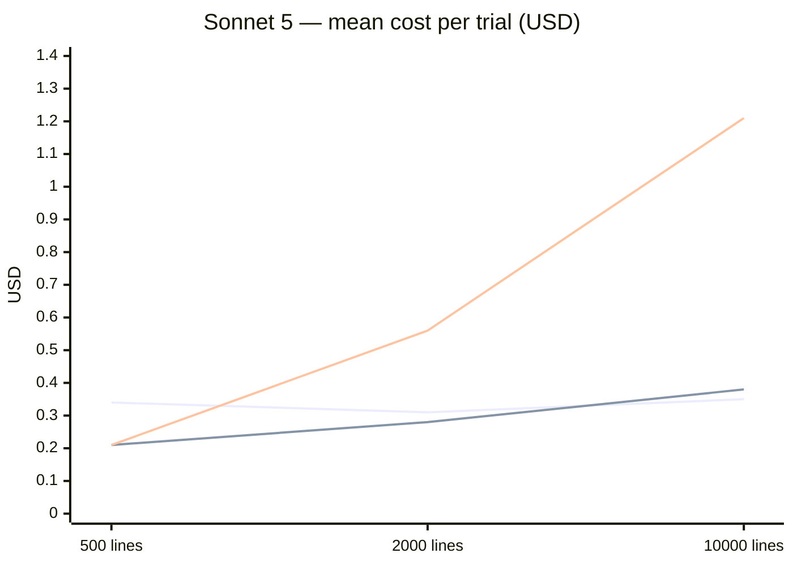
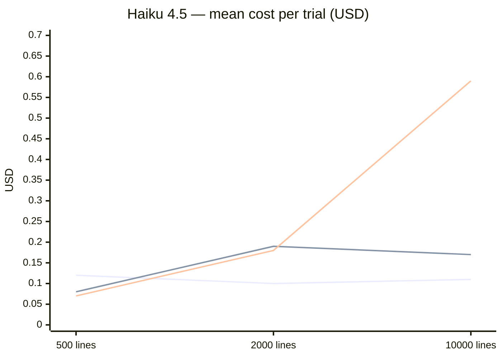

<p align="center">
  
</p>

# djinnvim

**Vim for AI agents: keyhole editing with vim's vocabulary and ed's discipline.**

djinnvim is an MCP server that lets an agent edit files *without ever reading them whole*. The agent navigates by pattern, edits with vim's compact command vocabulary, and after every single action gets back a small viewport of the buffer — the tool result *is* the screen. Nothing touches disk until an explicit `write`.

> ⚠️ **Status:** working prototype, benchmarked (data below), interface still being polished. Usage documentation will follow once the MCP surface and a CLI companion are settled.

## The idea

Agent editing flows today are token-expensive on both sides:

- **Read side:** agents load entire files into context — a 2 000-line file is ~15 k tokens — even when the task touches ten lines.
- **Write side:** `str_replace`-style tools require reproducing long verbatim spans (old text + new text) for every edit.

djinnvim replaces both with a *keyhole*:

- **Navigate by pattern, never by reading.** `/regex` searches, text objects, anchored edits — position is always established by content, never by counting lines or holding the file in context.
- **Edit with vim's count-free vocabulary.** `ciw`, `dap`, `cs"'`, ex-style `:s///` — a command set that is small, compositional, semantic, and deeply represented in LLM training data. No novel DSL to teach.
- **Every action echoes a viewport.** Silent state changes are forbidden: navigation echoes where you landed, edits echo the post-edit region as a diff. Write-verification comes free; errors become visible immediately instead of silently corrupting the file.

### A vim for AIs must work like ed

djinnvim *is* vim for AIs — but building one honestly means asking what an AI actually sees. A human vim user works under *free feedback*: the whole screen is always there, updated instantly after every keystroke, which is exactly what makes long command sequences and macros affordable. An agent has no screen. It perceives the buffer only through what tool results echo back — one small glimpse per round trip, each glimpse paid for in tokens. That is the world of the teletype, not the terminal screen, and the editor built for that world was **ed**: pattern addressing, one command per call, terse echoes, precisely because feedback was expensive.

So a vim translated to the AI's way of seeing keeps vim's *vocabulary* — text objects, surround, ex substitution, the syntax dense in the model's training data — but runs it under ed's *discipline*: one command, one echo, never a blind sequence. Faithfully porting vim's screen-era design point would let agents fire long keystroke chains without looking, which is exactly where blind edits go wrong.

One consequence: djinnvim allows **declarative** big shots (a single complex regex substitution over the whole file — one pattern, one transformation, no intermediate state) but rejects **imperative** ones (keystroke sequences and macros, where the model must blindly simulate buffer state between commands). The benchmark below measures exactly why: big blind shots are where silent errors live.

## Where it fits

Two audiences, two arguments — both measured below:

1. **Token economy.** Keyhole editing cost is driven by the *edit*, not the *file*: in our sweep, cost per task stays flat from 500 to 10 000 lines while every read-the-file approach grows with size.
2. **Locked-down agents.** A stock agent's editing power comes largely from Bash (`grep` + `sed`) — exactly the permission a cautious user denies, since it is arbitrary command execution. Denying Bash today means losing pattern search and bulk search-replace entirely. djinnvim gives that capability class back through a narrowly scoped tool set with a containment story `sed -i` can't offer: root-sandboxed paths, an in-memory buffer as a review point before `write`, undo, and per-tool permission granularity (a client can allow read-only exploration while gating writes).

Honest scope: this compensates for the *editing and search* disadvantage of denying shell access, not the whole disadvantage — a Bash-less agent still can't run tests or git.

## The benchmark

We benchmarked djinnvim against stock Claude Code with generated ground-truth tasks. Every trial is a **cold session**: a fresh headless `claude -p` process in a fresh temp directory containing one generated Python file, a natural-language prompt, and nothing else — all operating knowledge must come from the tool descriptions.

**Three conditions**, same model and prompt in each:

| Condition | Tooling |
|---|---|
| **keyhole** | djinnvim only — all native file/shell tools disallowed |
| **baseline** | stock Claude Code, all native tools incl. Bash (`grep`/`sed` allowed and used) |
| **no-bash** | stock native file tools, shell execution denied — the locked-down configuration of a cautious user |

**Grid:** 7 tasks × 3 file sizes (500 / 2 000 / 10 000 lines) × 2 models (Haiku 4.5, Sonnet 5) × 3 conditions × 3 trials. Every task is generated together with its exact target file, so **correctness is a mechanical diff, not a judge**. We report two columns: **exact** (byte-identical to target) and **semantic** (AST-equal — same program, formatting-only divergence tolerated).

**Why no higher tier?** Opus-class models are unreasonably expensive for tasks of this shape — a full round costs a multiple of the entire remaining sweep, for edits a mid-tier model already handles. The Haiku → Sonnet trend (correctness gaps close while the cost curves keep their shape) suggests the pattern continues one tier up, but we have no measured data for that and don't claim it.

### The tasks

The tasks are distilled from real editing sessions, and the interesting ones contain **traps**: the prompt is natural and unambiguous — any careful reader knows exactly what is meant — but the *obvious one-shot answer* (one `sed` call, one file-wide regex) silently corrupts the file. The prompt never warns about the trap; noticing it is part of the task. Each expandable block below shows the verbatim prompt, the tempting shortcut, and what it silently breaks.

<details>
<summary><b>rename-trap</b> — rename a function across scattered call sites</summary>

> "In pipeline.py, rename the function `fetch_records` to `load_records` — its definition and all its call sites."

The tempting one-shot: `sed -i 's/fetch_records/load_records/g' pipeline.py`. But the file also contains a *different* function with a colliding prefix:

```python
def fetch_records_cached(db, limit):   # a separate function —
    if limit not in _CACHE:            # must keep its name
        _CACHE[limit] = fetch_records(db, limit)   # only THIS call renames
```

Without a word boundary (`\bfetch_records\b`) the sed also produces `load_records_cached` — everywhere it appears. The file still parses, nothing errors, the agent reports success: a **silent corruption**. This exact miss happened in the benchmark (Haiku baseline, 500 lines).
</details>

<details>
<summary><b>bump-trap</b> — change a default parameter value</summary>

> "In pipeline.py, the default timeout of `send_request` is too low: change it from 30 to 90."

Only **one** line may change:

```python
def send_request(url, timeout=30, retries=3):   # ← the default: 30 → 90
```

But the file is salted with lookalikes that a broad replace destroys: half the call sites pass an *explicit* `timeout=30` — a deliberate choice by that caller, which must survive a change of the default — and an unrelated constant matches too:

```python
POLL_INTERVAL = 30                         # not a timeout — keep
    return send_request(url, timeout=30)   # caller's explicit choice — keep
    return send_request(url)               # uses the default — keep
```

A file-wide `s/timeout=30/timeout=90/` or `s/30/90/` "succeeds", changes the meaning of dozens of call sites, and nothing crashes.
</details>

<details>
<summary><b>delete-trap</b> — remove all debug calls</summary>

> "Remove all the `log_debug` calls from pipeline.py (keep the `log_debug` function definition itself)."

The tempting one-shot deletes every line matching `log_debug`. Two things break silently:

```python
def log_debug(msg):                        # the definition — must survive
    print(f'DEBUG: {msg}')

    log_debug('enter check_totals')        # ← these lines go
    summary = log_debug_summary(stats)     # different function — must survive
```

`log_debug_summary` is a name-collision decoy: a pattern like `/log_debug/d` deletes its call sites too, breaking live code paths — and deletes the definition the prompt explicitly said to keep.
</details>

<details>
<summary><b>quote-trap</b> — normalize quote style file-wide</summary>

> "In pipeline.py, convert every single-quoted string literal to double quotes."

Thousands of quote changes — clearly a job for one regex like `s/'([^']*)'/"\1"/g`. The trap is that comments contain **apostrophes**:

```python
    # note: caller's dict is not copied
    return f'{label}: {count}'
```

An apostrophe is an unpaired single quote: the regex pairs `caller'` with the next quote it finds and rewrites the wrong span — or, applied over the whole file, shifts every subsequent match off by one. The correct answer must treat comment lines differently from code, which no single blind regex does.
</details>

<details>
<summary><b>composite</b> — six heterogeneous edits in one task</summary>

One prompt, six numbered changes — a compressed version of a real refactoring request: rename `fetch_records` → `load_records` (with the `_cached` decoy present), change a default value, delete all `log_debug` calls, change a constant, insert a new constant at a stated position, and thread a `logger` argument through **every** `send_request` call site. The last one is the structural trap — some call sites are multi-line:

```python
    response = send_request(
        endpoint,                # a new `logger,` argument must be
        timeout=7,               # inserted here — line-based sed
    )                            # cannot see "the second argument"
```

Line-oriented tools match single lines; "add a second argument" on a call spread over four lines defeats them. This is the most representative task of real usage — and the one where exact-match grading mostly disagrees with semantic grading (argument-wrapping styles differ while the program is identical).
</details>

<details>
<summary><b>move-multi</b> — gather scattered functions</summary>

> "In pipeline.py, the three `check_*` functions are scattered through the file. Move them so they sit directly above `run_checks`, in this order: `check_ids`, `check_totals`, `check_names`. Keep exactly two blank lines between top-level functions and change nothing else."

There is **no search-and-replace answer at all**: nothing changes textually, text only *moves*. The solver must delete three function bodies from three different places and reinsert them at a fourth, in a stated order, with exact blank-line discipline — while never seeing the whole file. This is cut/yank/put register territory (djinnvim's home turf), and for read-the-file approaches the cost of "find everything, rewrite the region" grows with file size.
</details>

<details>
<summary><b>purge-blocks</b> — delete every deprecated function</summary>

> "In pipeline.py, several functions are marked deprecated with a `# DEPRECATED: …` comment on the line directly above their def. Remove every deprecated function entirely — the comment line and the whole function below it. Keep exactly two blank lines between the remaining top-level definitions."

At 10 000 lines this means removing **dozens** of variable-length multi-line blocks:

```python
# DEPRECATED: use resolve_offsets instead
def normalize_totals(rows):
    for row in rows:
        ...                     # block length varies — no fixed line count
```

The classic shortcut `sed '/DEPRECATED/,/^$/d'` deletes from the marker to the next blank line — but functions are separated by *two* blank lines, so every deletion site leaves a stray blank behind (or eats one too many): dozens of small, silent, off-by-one wounds. djinnvim's answer is a single anchored batch edit — `at each /# DEPRECATED/ dap` (*delete around paragraph* at every match) — while a Bash-less native agent must grind through every block by hand. This task produced the starkest cost numbers in the sweep (see finding 3).
</details>

## What the data says

### 1. Big blind shots are where silent errors live

On a capable cheap model (Haiku), the Bash-armed baseline **silently corrupts files**: 5 of its 9 failures are genuinely wrong output — missing word boundaries, mangled decoys, blank-line miscounts — usually accompanied by a claim of success. Keyhole's failures on the same model are almost all **formatting-only**: the program is AST-identical to the target, a line got wrapped differently.

|  | exact match | semantically correct | real silent errors |
|---|---|---|---|
| Haiku keyhole | 49/62 | **59/62** | 3 |
| Haiku baseline | 53/62 | 57/62 | **5** |
| Sonnet keyhole | 59/63 | **63/63** ¹ | 0 |
| Sonnet baseline | 62/63 | 63/63 ² | 0 |

¹ Sonnet keyhole's two composite cells lost their outputs before the AST sweep, so both cells were fully re-run with outputs kept, and the re-runs replace the originals wholesale — kept regardless of outcome (the exact score dropped from 61 to 59 in the trade). All four non-exact re-run trials are AST-equal formatting (argument wrapping, blank lines), which is what makes the 63/63 verified rather than argued.

² Sonnet baseline's two cells with lost outputs (purge-blocks @ 500, quote-trap @ 10 000) were fully re-run under the same whole-cell policy: exact rose to 62/63 and the one remaining miss is AST-equal formatting — no confirmed silent errors at the Sonnet tier, in either condition.

Under exact-match grading Haiku's keyhole and baseline look close; under semantic grading they diverge — **keyhole's misses are cosmetic, the baseline's are wrong code**. On Sonnet both conditions are semantically clean; there the difference is money, not correctness (findings 2 and 3). The cheap-model asymmetry is the product bet: echo discipline turns errors visible before they land.

### 2. Keyhole cost is flat in file size

Mean cost per trial (USD) as the file grows from 500 → 2 000 → 10 000 lines:





*Series, top to bottom at 10 000 lines: **no-bash**, **baseline**, **keyhole**.*

**🔍 [Interactive cost explorer](docs/cost-explorer.html)** — switch model, drill into single tasks (with per-trial dots), hover for trial-level costs, expand a data table. GitHub strips scripts from READMEs, so it can't render inline: open the file locally in a browser, or serve it via GitHub Pages (`Settings → Pages → main /docs`) and link it from here.

Keyhole is flat (~$0.33 Sonnet, ~$0.11 Haiku, regardless of size) because it never pays for the file, only for the edit. Every read-the-file condition grows with size. Honest caveat: at 500 lines the full baseline is *cheaper* than keyhole — the win is the flat curve and the lockdown story, not small-file economy.

### 3. Deny Bash, and the cost depends on your model tier

The **no-bash** condition is the measured version of the permission-management argument — what actually happens when a cautious user denies shell execution:

- **Cheap model (Haiku): correctness collapses on structural tasks.** 56/63 exact, and all 7 misses concentrate on the file-wide/structural tasks (quote-trap, composite, purge-blocks) — 4 of them semantically wrong output, i.e. silent corruption, the rest formatting-only. The simple trap tasks are fine — grinding per-site `Edit` calls avoids the sed traps — but purge-blocks@10 000 stayed 0-for-clean, with 2 of 3 trials silently wrong.
- **Frontier model (Sonnet): correctness holds, money doesn't.** 62/62 exact — but cost climbs $0.21 → $0.56 → $1.21 with size, and on purge-blocks@10 000 it initially **blew through a $3-per-trial budget five times in a row** (per-site editing, ~130 tool calls). With the budget raised to $8 it finishes cleanly — at **$4.6 per trial, ~14× keyhole's $0.33** on the same cell.
- **Keyhole is unaffected by the lockdown** — it never used those tools to begin with. Same flat cost, same correctness.

So the claim is task-shaped, not blanket: deny Bash to a cheap model and you pay in silent corruption; deny it to a frontier model and you pay in dollars that grow with file size. djinnvim removes the trade-off.

<details>
<summary><b>Per-task exact-match breakdown (all conditions)</b></summary>

Exact matches / clean trials. Keyhole's composite and move-multi misses are almost entirely AST-equal formatting divergence (see finding 1).

**Haiku 4.5**

| task | keyhole | baseline | no-bash |
|---|---|---|---|
| rename-trap | 9/9 | 8/9 | 9/9 |
| bump-trap | 9/9 | 9/9 | 9/9 |
| delete-trap | 9/9 | 8/9 | 9/9 |
| quote-trap | 9/9 | 7/9 | 8/9 |
| composite | 2/9 ³ | 7/9 | 6/9 |
| move-multi | 3/9 ³ | 8/9 | 9/9 |
| purge-blocks | 8/8 | 6/8 | 6/9 |

³ composite: 5 of 7 misses AST-equal (7/9 semantic); move-multi: 5 of 6 misses AST-equal (8/9 semantic).

**Sonnet 5**

| task | keyhole | baseline | no-bash |
|---|---|---|---|
| rename-trap | 9/9 | 9/9 | 9/9 |
| bump-trap | 9/9 | 9/9 | 9/9 |
| delete-trap | 9/9 | 9/9 | 9/9 |
| quote-trap | 9/9 | 9/9 | 9/9 |
| composite | 5/9 ⁴ | 9/9 | 9/9 |
| move-multi | 9/9 | 9/9 | 9/9 |
| purge-blocks | 9/9 | 8/9 | 8/8 ⁵ |

⁴ The 2 000/10 000-line cells are the whole-cell re-runs (see finding 1); all four misses AST-equal formatting (9/9 semantic).
⁵ The two 10 000-line trials required a raised budget ($8) and cost $4.6 each; under the default $3 cap this cell had zero clean trials in five attempts.
</details>

<details>
<summary><b>Methodology fine print</b></summary>

- Driver: headless Claude Code (`claude -p --output-format stream-json`); cost/token/tool-call numbers come from the CLI's own usage accounting, per trial.
- Trials with harness aborts (session/usage limits, budget caps) are flagged and excluded from correctness scores; aborted cells were re-run.
- "Semantic" = Python `ast` equality between output and target. Every non-exact trial in the grid has been AST-classified against its retained output — the semantic column is a measurement, not a lower bound.
- Some early cells lost their outputs before the AST sweep (workdirs defaulted to system tmp). Every such cell was fully re-run with outputs kept, and the re-run replaces the original cell wholesale — all 3 trials, kept regardless of outcome, never a per-trial retry. This cut both ways: Sonnet keyhole's exact score *fell* 61 → 59, Haiku no-bash's confirmed silent errors *rose* 1 → 4, Sonnet baseline *improved* to 62/63.
- n=3 per cell — directional, not publication statistics. Tasks are single-file generated Python; multi-file editing is future work.
- The Haiku keyhole/baseline round ran on a slightly older Claude Code CLI than the rest of the grid; cross-round comparisons are indicative.
- Model IDs: `claude-haiku-4-5`, `claude-sonnet-5` (see "Why no higher tier?" above for the deliberate Opus omission).
</details>

## Design principles

1. **Only syntax already in the weights.** Vim motions, text objects, surround, ex substitution — no novel DSL. Where behavior deviates from vim, the surface is plain English (`at each /pattern/ dap`), never a vim lookalike that would make the model trust its priors over the tool.
2. **No counts, no cursor arithmetic.** LLMs are unreliable at `7j`. Everything anchors by pattern or text object.
3. **Every action echoes a viewport.** Navigation echoes where you landed; edits echo a diff. No silent state changes, ever.
4. **Global awareness via search visibility, not content.** Match counts and one-line-per-hit listings compensate for the keyhole's blindness — never full-file dumps.

## Sandboxing

Every path is validated against a set of sandbox roots — resolved (symlinks followed) *before* the containment check, so a link inside a root pointing outside is rejected. Roots come from the first available source: the `DJINNVIM_ROOTS` env var (`PATH`-style separated list; `DJINNVIM_ROOT` works as a single-path alias) → the MCP client's `roots/list` grants (updates honored live; a buffer whose root is revoked refuses to `write`) → `CLAUDE_PROJECT_DIR` → the server's working directory. Env roots are exclusive: when set, client grants are ignored — a pinned boundary no client chatter can widen. `/` and `$HOME` are refused as roots from every non-explicit source.

Two honest caveats. The sandbox confines the *agent* (model-generated paths, prompt injection), not a hostile local user — TOCTOU races are out of scope, matching the exposure of native editing tools. And permission granularity differs from native editors that can re-prompt per edit: djinnvim's `write`, once allowed as a tool, is allowed across the whole sandbox — the same posture as an editor in accept-edits mode, not a regression, but worth knowing.

## Roadmap

- Polish the MCP tool surface (descriptions, error signposting)
- A CLI companion for human use and scripting
- Usage & setup documentation (deliberately postponed until the above settle)

---

*This project is developed in collaboration with AI: design, implementation, and benchmark analysis are AI-assisted (Claude). Design decisions and full benchmark records live in [`design.md`](design.md).*
